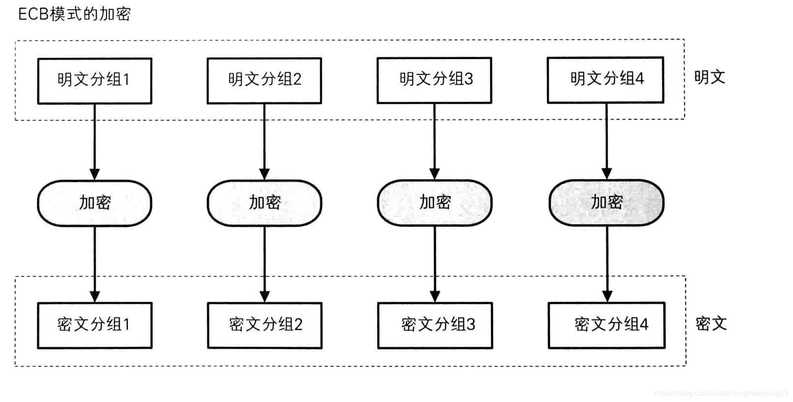
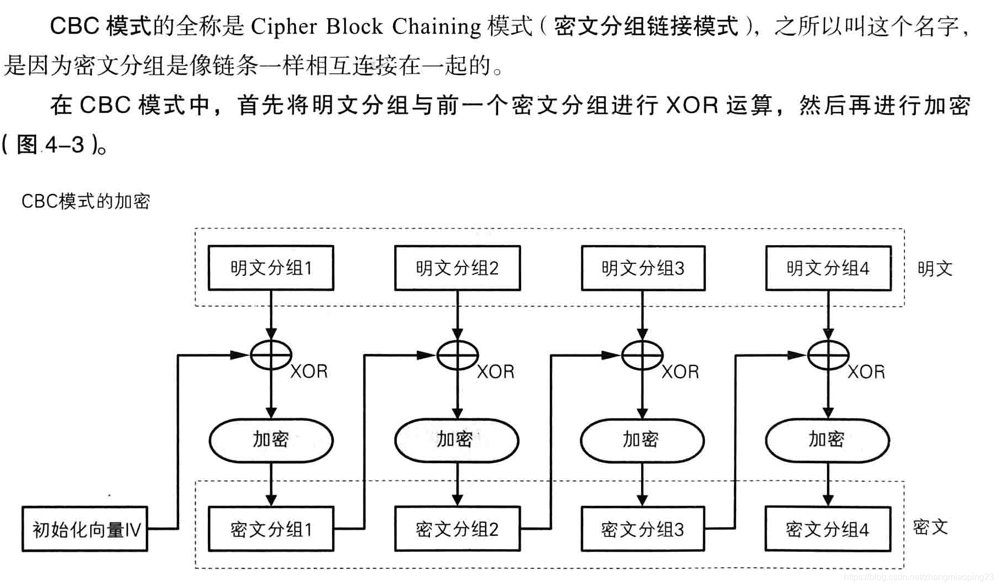

## 1.1 DES

### 1.1.1 简介

- Data encrypt standard 数据加密标准  
- 入参: 64比特(8个字节、16个16进制数)
- key: 64比特(8个字节、16个16进制数)
- 结果:  64比特(8个字节、16个16进制数)
- DES分两部分：明文的处理以及密钥的编排
- 二进制流处理

### 1.1.2 手算DES

- 前置

   input: 0123456789abcdef (hex)

   key: 133457799bbcdff1(hex)

   output: 85e813540f0ab405 (hex)

   模式: ECB

- 第0步：初始置换

  初始置换表:

  ```python
  PI =   [58, 50, 42, 34, 26, 18, 10, 2,
  	      60, 52, 44, 36, 28, 20, 12, 4,
  	      62, 54, 46, 38, 30, 22, 14, 6,
  	      64, 56, 48, 40, 32, 24, 16, 8,
  	      57, 49, 41, 33, 25, 17, 9, 1,
  	      59, 51, 43, 35, 27, 19, 11, 3,
  	      61, 53, 45, 37, 29, 21, 13, 5,
  	      63, 55, 47, 39, 31, 23, 15, 7]
  ```

  需要对`input`重新排列。根据PI表的索引指示，对明文重新排列，58就是找明文第58个

  > 注：数的时候input从1开始不是0, 看PI表的顺序为从左到右然后从上至下）

  input的二进制表现形式为：`00000001 00100011 01000101 01100111 10001001 10101011 11001101 11101111`

  置换后的结果为：`11001100 00000000 11001100 11111111 11110000 10101010 11110000 10101010`

- 第一步：密钥的编排

  密钥的二进制表现形式为：`00010011 00110100 01010111 01111001 10011011 10111100 11011111 11110001`

  使用PC1(置换选择表1)，只有56个位置，用法同上。des密钥一共64位，只有56位被使用。

  ```python
   CP_1 = [57, 49, 41, 33, 25, 17, 9,
          1, 58, 50, 42, 34, 26, 18,
          10, 2, 59, 51, 43, 35, 27,
          19, 11, 3, 60, 52, 44, 36,
          63, 55, 47, 39, 31, 23, 15,
          7, 62, 54, 46, 38, 30, 22,
          14, 6, 61, 53, 45, 37, 29,
          21, 13, 5, 28, 20, 12, 4]
  ```

  置换后的结果为：`1111000 0110011 0010101 0101111 0101010 1011001 1001111 0001111` 

  > 注：此时由64为变成了56位

  ---------------------------------------------------------------

  平等拆成两块：

    Left0：`1111000 0110011 0010101 0101111`
    Right0：`0101010 1011001 1001111 0001111`

  然后进行循环左移，进行一共16轮运算：

  ​	SHIFT = [1,1,2,2,2,2,2,2,1,2,2,2,2,2,2,1] 

  L1:   对Left0左移1位, 位数 = SHIFT[0] = 1 得到 `1110000 1100110 0101010 1011111`

  R1 :  对right左移1位, 位数 = SHIFT[0] = 1 得到 `1010101 0110011 0011110 0011110`

  然后进行拼接：

  ​	L1 + R1:1110000 1100110 0101010 1011111 1010101 0110011 0011110 0011110

  使用PC2(置换选择表2)进行置换，只有48个位置

  ```python
  CP_2 = [14, 17, 11, 24, 1, 5, 3, 28,
          15, 6, 21, 10, 23, 19, 12, 4,
          26, 8, 16, 7, 27, 20, 13, 2,
          41, 52, 31, 37, 47, 55, 30, 40,
          51, 45, 33, 48, 44, 49, 39, 56,
          34, 53, 46, 42, 50, 36, 29, 32]
  ```

  L1R1经过置cp_2置换后的结果为： 00011011 00000010 11101111 11111100 01110000 01110010 , 得到了第一个子密钥k1，注意：此时由56为变成了48位

  ------------------------------------

  L2:  对L1进行左移SHIFT[1]位, 得到 110000 1100110 0101010 10111111  
  R2: 对R1进行左移SHIFT[1]位, 得到 010101 0110011 0011110 00111101  
	append后得到L2R2与CP_2继续置换生成k2  
  循环往复直到生成k16，16轮的k/子密钥  

- 第二步：明文的处理

  上文已经对明文的重排并得到了结果：`11001100 00000000 11001100 11111111 11110000 10101010 11110000 10101010`并得到了了`16`个子密钥

  把重排的结果分两半
   L0: `11001100 00000000 11001100 11111111`

   R0: `11110000 10101010 11110000 10101010`

   L1: R0 (总是上一步的R)

   R1: L0 + F(R0, K1)   可以看到得到Rn的公式就是: Rn = Ln -1 + F(Rn -1, kn）, 注: 此刻的+号为异或运算

  -------------------

   F 函数中 

  第一步: E(R0) 和k做异或使用EXPEND表把R0 32位 扩展到48位，因为之后要与密钥异或，密钥都是48位的所以要扩充到48位

  ```python
     [ 32, 1,  2,  3,  4,  5,
       4,  5,  6,  7,  8,  9,
       8,  9,  10, 11, 12, 13,
       12, 13, 14, 15, 16, 17,
       16, 17, 18, 19, 20, 21,
       20, 21, 22, 23, 24, 25,
       24, 25, 26, 27, 28, 29,
       28, 29, 30, 31, 32, 1]
  ```

  ​	得到结果`01111010 00010101 01010101 01111010 00010101 01010101`

  第二步：E(R0) ^ k，和k做异或

  ​	得到结果`011000 010001 011110 111010 100001 100110 010100 100111` 此时为48位。

  第三步：S(E(R0) ^ k) ，在S盒中找到对应的位置。

  ​	把第二步得到的结果经过`B1B2B3B4B5B6B7B8`此规则分段，那么就会得到：

  ```
   	B1: 011000
   	B2: 010001
   	B3: 011110
   	B4: 111010
   	B5: 100001
   	B6: 100110
   	B7: 010100
   	B8: 100111
  ```

  ​     以B1`011000`为例，分成两部分：

     -  第一部分：第一位和最后一位 00，对应的 `10进制`为0，也就是第0行
    -  第二部分：中间4位为1100，对应的 `10进制`为12列，也就是第12列。

     在S盒中从0开始数 （从S_BOX第0个索引开始找），那么就代表着s盒的 第一行第12个 -> 就是5 转成二进制为0101。

  ​     以B2`010001`为例，分成两部分，因为是B2，就从S_BOX[1]开始数：

    - 第一部分：第一位和最后一位 01，对应的 `10进制`为1，也就是第1行
    - 第二部分：中间4位为1000，对应的 `10进制`为8。

     从S_BOX第一个索引开始数(1,8 ) -> 12 转成二进制为1100。

  ​	最后8轮 * 4位数 S(E(R0) ^ k) 的结果就变成了32位。

  ```python
   	S_BOX = [
  
      [[14, 4, 13, 1, 2, 15, 11, 8, 3, 10, 6, 12, 5, 9, 0, 7],
       [0, 15, 7, 4, 14, 2, 13, 1, 10, 6, 12, 11, 9, 5, 3, 8],
       [4, 1, 14, 8, 13, 6, 2, 11, 15, 12, 9, 7, 3, 10, 5, 0],
       [15, 12, 8, 2, 4, 9, 1, 7, 5, 11, 3, 14, 10, 0, 6, 13],
       ],
  
      [[15, 1, 8, 14, 6, 11, 3, 4, 9, 7, 2, 13, 12, 0, 5, 10],
       [3, 13, 4, 7, 15, 2, 8, 14, 12, 0, 1, 10, 6, 9, 11, 5],
       [0, 14, 7, 11, 10, 4, 13, 1, 5, 8, 12, 6, 9, 3, 2, 15],
       [13, 8, 10, 1, 3, 15, 4, 2, 11, 6, 7, 12, 0, 5, 14, 9],
       ],
  
      [[10, 0, 9, 14, 6, 3, 15, 5, 1, 13, 12, 7, 11, 4, 2, 8],
       [13, 7, 0, 9, 3, 4, 6, 10, 2, 8, 5, 14, 12, 11, 15, 1],
       [13, 6, 4, 9, 8, 15, 3, 0, 11, 1, 2, 12, 5, 10, 14, 7],
       [1, 10, 13, 0, 6, 9, 8, 7, 4, 15, 14, 3, 11, 5, 2, 12],
       ],
  
      [[7, 13, 14, 3, 0, 6, 9, 10, 1, 2, 8, 5, 11, 12, 4, 15],
       [13, 8, 11, 5, 6, 15, 0, 3, 4, 7, 2, 12, 1, 10, 14, 9],
       [10, 6, 9, 0, 12, 11, 7, 13, 15, 1, 3, 14, 5, 2, 8, 4],
       [3, 15, 0, 6, 10, 1, 13, 8, 9, 4, 5, 11, 12, 7, 2, 14],
       ],
  
      [[2, 12, 4, 1, 7, 10, 11, 6, 8, 5, 3, 15, 13, 0, 14, 9],
       [14, 11, 2, 12, 4, 7, 13, 1, 5, 0, 15, 10, 3, 9, 8, 6],
       [4, 2, 1, 11, 10, 13, 7, 8, 15, 9, 12, 5, 6, 3, 0, 14],
       [11, 8, 12, 7, 1, 14, 2, 13, 6, 15, 0, 9, 10, 4, 5, 3],
       ],
  
      [[12, 1, 10, 15, 9, 2, 6, 8, 0, 13, 3, 4, 14, 7, 5, 11],
       [10, 15, 4, 2, 7, 12, 9, 5, 6, 1, 13, 14, 0, 11, 3, 8],
       [9, 14, 15, 5, 2, 8, 12, 3, 7, 0, 4, 10, 1, 13, 11, 6],
       [4, 3, 2, 12, 9, 5, 15, 10, 11, 14, 1, 7, 6, 0, 8, 13],
       ],
  
      [[4, 11, 2, 14, 15, 0, 8, 13, 3, 12, 9, 7, 5, 10, 6, 1],
       [13, 0, 11, 7, 4, 9, 1, 10, 14, 3, 5, 12, 2, 15, 8, 6],
       [1, 4, 11, 13, 12, 3, 7, 14, 10, 15, 6, 8, 0, 5, 9, 2],
       [6, 11, 13, 8, 1, 4, 10, 7, 9, 5, 0, 15, 14, 2, 3, 12],
       ],
  
      [[13, 2, 8, 4, 6, 15, 11, 1, 10, 9, 3, 14, 5, 0, 12, 7],
       [1, 15, 13, 8, 10, 3, 7, 4, 12, 5, 6, 11, 0, 14, 9, 2],
       [7, 11, 4, 1, 9, 12, 14, 2, 0, 6, 10, 13, 15, 3, 5, 8],
       [2, 1, 14, 7, 4, 10, 8, 13, 15, 12, 9, 0, 3, 5, 6, 11],
       ]
  ]
  ```

  第四步：P置换，将S盒后得到的结果经过P表进行置换，重新排列后得到32位。

  ```python
  P = [16, 7, 20, 21, 29, 12, 28, 17,
       1, 15, 23, 26, 5, 18, 31, 10,
       2, 8, 24, 14, 32, 27, 3, 9,
       19, 13, 30, 6, 22, 11, 4, 25]
  ```

  第五步：最后 L0 + f函数  

  > 注: 此时+号为异或运算

  

- 经过上述步骤周而复始最后得到L16R16，将L16 R16 倒换相加, 最后一轮才倒换，别的轮次不用。

  L16: `01000011 01000010 00110010 00110100`
  R16: `00001010 01001100 11011001 10010101`

  R16L16: `00001010 01001100 11011001 10010101 01000011 01000010 00110010 00110100`

- 最后通过PI_1表进行末位置换得到结果

  ```python
  PI_1 = [40, 8, 48, 16, 56, 24, 64, 32,
          39, 7, 47, 15, 55, 23, 63, 31,
          38, 6, 46, 14, 54, 22, 62, 30,
          37, 5, 45, 13, 53, 21, 61, 29,
          36, 4, 44, 12, 52, 20, 60, 28,
          35, 3, 43, 11, 51, 19, 59, 27,
          34, 2, 42, 10, 50, 18, 58, 26,
          33, 1, 41, 9, 49, 17, 57, 25]1.13
  ```


### 1.1.3 问题

- DES的输入规定是64比特，如果输入的是56比特怎么办？或者是20比特？怎么进行填充？

  > des分组标准为8字节，缺几个字节就补0几
  >
  > 0123456789 5字节 缺三个字节 补充: 0123456789030303
  >
  > 0123450505050505
  >
  > 0123060606060606
  >
  > 0107070707070707

- 特殊情况  011 1.5字节怎么补充

  >先补充到 0101，在补充 0101060606060606

- 假如输入就是8字节，那也必须填充，填充一整个分组

  > 0123456789abcdef0808080808080808
  >
  > 如果输入是0808080808080808，就可以看到一个现象：结果为两个相同的8字节拼在一起

- 明文可以缺少可以填充(规则pkcs#7)，密钥是不可以的必须符合要求

- 当明文输入大于64比特怎么办？比如100比特长

  > padding填充成128比特，就变成了两个分组大小

- 每个分组单独处理？还是彼此之间有联系呢？

  > 这就是工作模式，每个分组单独加密，就好像很多个一分组的DES的这种处理方式。

### 1.1.4 工作模式

- ECB 模式

  > 这种模式有很多好处，我们可以直接for 循环，将很长的输入分成对应个数的分组，每个分组得到结果后拼接在一起就行，而且这也意味着可以并行计算。
  >
  > 如果ECB模式是可行的、安全的，那么我们一定选择它，因为最简单和高效。那也就不会出现别的工作模式了，可惜的是它并不安全。ECB 相同的分组输入，计算后的秘文结果是完全一致的，相同的明文会被加密成相同的密文，这是很危险的。

  

- 最常用的是CBC模式

  > 其实想法也很朴素，每个明文分组在加密前多一个步骤，和上一个分组的密文块进行异或运算。
  >
  > 因为第一个明文块没有所谓的“上一个分组的密文块“，所以需要人给一个64比特，或者说8字节的输入，我们叫它初始化向量，IV。

  接下来想一下，怎么单独的算出它？

  在cyberchef中验证一下

  > 明文：123456789ABCDEF0
  >
  > 密钥：133457799BBCDFF1
  >
  > IV：0123456789ABCDEF
  >
  > 模式：CBC模式
  >
  > 结果：0ecb68bac16aece0 7cbadcfa7a974bcc
  >

  按照我们上面的说法，结果的明文应该就是`123456789ABCDEF0`和IV`0123456789ABCDEF`异或的结果。

  使用cyberchef计算123456789ABCDEF0 ^ 0123456789ABCDEF 得到结果`1317131f1317131f`，单独计算其DES加密结果，注意这儿要用ECB模式: `0ecb68bac16aece0 fdf2e174492922f8`，因为`1317131f1317131f`是一个分组的长度，所以要填充`0808080808080808`， `fdf2e174492922f8`是`08`的结果，所以不用管。可以发现，第一块加密结果`0ecb68bac16aece0`正是我们所预期的。

  接下来看一下第二块，第二块即0808080808080808，按照CBC的规则计算 0ecb68bac16aece0 ^ 0808080808080808 = `06c360b2c962e4e8`，单独计算ECB下的`06c360b2c962e4e8` 结果为`7cbadcfa7a974bcc  fdf2e174492922f8`，第二块结果`7cbadcfa7a974bcc`也完全正确。

  我们对CBC模式的理解已经到位了。

  

- CFB模式

  > 明文：123456789ABCDEF0
  >
  > 密钥：133457799BBCDFF1
  >
  > IV：0123456789ABCDEF
  >
  > 模式：CFB
  >
  > 结果: 97dc452c95b66af5
  >
  > 
  >
  > IV即0123456789ABCDEF的des加密结果85e813540f0ab405
  >
  > 85e813540f0ab405 与 123456789ABCDEF0 的异或结果是97dc452c95b66af5

  

- OFB

  > 明文：123456789ABCDEF0
  >
  > 密钥：133457799BBCDFF1
  >
  > IV：0123456789ABCDEF
  >
  > 模式：OFB
  >
  > 结果: 97dc452c95b66af5
  >
  > 即一个分组的OFB与CFB是一样一样的

  两个分组的计算：

  > 明文：123456789ABCDEF0 123456789ABCDEF0
  >
  > 密钥：133457799BBCDFF1
  >
  > IV：0123456789ABCDEF
  >
  > 模式：OFB
  >
  > 结果：97dc452c95b66af5  759a2c51fb637db5

  直接观察第二个分组`759a2c51fb637db5`是如何计算出来呢?

  它是明文和加密两次的IV的异或结果

  明文：`123456789ABCDEF0` 加密第一次：`85e813540f0ab405` 加密第二次 `67ae7a2961dfa345f`，最后异或 67ae7a2961dfa345f ^ 123456789ABCDEF0 = `759a2c51fb637db5`

  

### 1.1.5 DES算法的细节

DES算法虽然不算复杂，但可以说是划时代的加密算法。

### 1.1.6 参考

- [对称加密的逆向特征_zhangmiaoping23的专栏-CSDN博客_aes逆向](https://blog.csdn.net/zhangmiaoping23/article/details/8949290)

- https://ctf-wiki.org/crypto/blockcipher/des/

- [IDAPython实战项目——DES算法识别 - 安全客，安全资讯平台 (anquanke.com)](https://www.anquanke.com/post/id/177808#h3-5)

- https://bbs.pediy.com/thread-90593.htm

## 1.2  3DES

- 三重DES是什么? 不是把DES做三遍。
- 先加密后解密再加密，这就是标准的3DES，也叫EDE方案，即Encrypt-Decrypt-Encrypt方案。解密时就是解密-加密-解密。
- 需要传入24个字节或者说三个密钥

  * 前8字节是第一步DES加密的密钥
  * 中间8字节是第二步DES解密的密钥
  * 最后8字节是第三步DES加密的密钥

- 为什么要做这种奇怪的设计呢？

  1.DES的第二轮是解密，但因为第二轮的密钥并不是真不是正确的密钥，所以会进一步扰乱数据。

  2.DES是由IBM公司设计的，3DES的标准自然也是IBM提出的，IBM是这么想的，DES广泛用于银行等系统，这些系统的更新比较慢，因此兼容性问题是很重要的议题。加密-解密-加密的3DES设计，在三个密钥都相同时，就变成了加密-对加密结果解密-再加密，即等同于普通的DES，这就实现了向下兼容。

```
明文： hex 12345
密钥： 3个密钥  192bits  3个64位的基础key 0123456789abcdef(hex)
k1k2k3
k1: 0123456789abcdef
k2: 0123456789abcdef
k3: 0123456789abcdef
3DES结果: a304f525d2d52cbf
DES的结果: a304f525d2d52cbf

- 结果是一样的，加密 解密 key一样，解密出来的还是原文，在加密就是一遍des加密
- IBM公司为了使DES应用在银行等公司，考虑兼容性，如果换成3个一样的key，结果和DES一样
- k1k2k3不相等 (k1,k2不相等即可，如果k1=k2相等，那么结果又会等与只做了一次k3的DES加密)
- 12345 -> DES加密(k1) -> DES解密(k2) 结果不等于明文, 相当于又做了一次加密，最后又做了一次加密，相当于做了三次加密
- 为什么不直接三次加密嘛，因为是考虑向下兼容，用3个一样的key即可，那么就是简单的DES
```

- Cyberchef 

  Cyberchef 用错误的密钥解密，得不出结果？
  因为des分组长度是64比特，分组：8字节
  当使用的input为123456(hex)时，3个字节需要补充为1234560505050505
  当解密的时候，Cyberchef会想把后面的05去掉，给你正确的明文，但是我们用不对的key解密的话后面不带05，就没法解析到05，所以就抱错。


