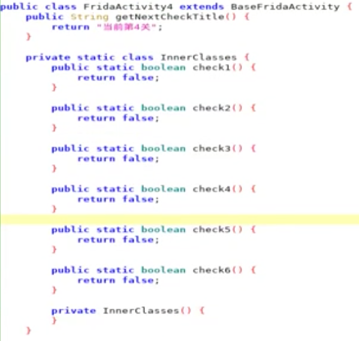
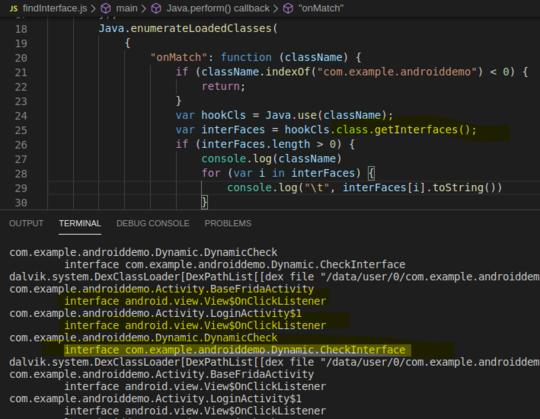

### Hook java

1. [输出bytes数组, bytesToString](https://github.com/heyhu/frida-agent-example/blob/master/code/rouse/hook_java/pass_invoke.js)  
   
   ```js
    // ByteString.of是用来把byte[]数组转成hex字符串的函数, Android系统自带ByteString类
    var ByteString = Java.use("com.android.okhttp.okio.ByteString");
    var j = Java.use("c.business.comm.j");
    j.x.implementation = function() {
        var result = this.x();
        console.log("j.x:", ByteString.of(result).hex());
        return result;
    };
    
    j.a.overload('[B').implementation = function(bArr) {
        this.a(bArr);
        console.log("j.a:", ByteString.of(bArr).hex());
    };
   ```

2. [密码爆破，在内存里主动调用](https://github.com/heyhu/frida-agent-example/blob/master/code/rouse/hook_java/pass_invoke.js)     

3. 构造一个aaaa字符串
   ```
   Java.use('Java.lang.String').$new('aaa')
   含义：.$new 使用构造方法创建实例
   注：如果字符串为$new生成出来的，则可以调用java层string类的方法。
   ```
   
4. [查找实例进行主动调用](https://github.com/heyhu/frida-agent-example/blob/master/code/rouse/hook_java/challenge_hook.js)
   ```
   java 方法分静态和动态 带static的方法可以直接调用，否则需要实例, 注意时机！一般不能用spwan。
   Java.choose的使用, 原型：Java.choose(className, callbacks)
   作用：在内存中扫描Java的堆(heap) 找到指定类(className)的实例化对象
   Java.use()与Java.choose()最大的区别，就是在于前者会新建一个对象，后者会选择内存中已有的实例。
   例子：
         var a;
         Java.choose('com.Tester.Mtop.a', {
         "onMatch":function(instance){   //该类有多少个实例，该回调就会被触发多少次
             a = instance
         },
         "onComplete":function(){}
           }
         )
   注意：类名为string -> 'com.Tester.Mtop.a'
   ```

5. [内部变量赋值修改](https://github.com/heyhu/frida-agent-example/blob/master/code/rouse/hook_java/challenge_hook.js)
    ```
   var a = Java.use("com.android.okhttp.okio.ByteString");
   static value_a = false //属性
   void value_b = false // 属性
   void value_c = false // 属性
   value_c  //方法
   静态成员可以直接设置结果： a.value_a.value = true;
   动态成员需要找到实例： instance_a.value_b.value = true; 
   如果方法属性同在，直接调用的是方法，想调用属性的话，前面加下划线：instance_a._value_c.value = true;
   ```

6. [查找内部类](https://github.com/heyhu/frida-agent-example/blob/master/code/rouse/hook_java/challenge_hook.js)  
   ```
    内部的a方法怎么用frida hook到 ?
    1. 用jadx看smali，内部类是有个分配给他的类似$a的名字的；
    2. 用objection去trace，打印所有类的实例，或者hook类的构造函数都可以。
   ```
      
   innerClass是activity4的内部类。   

7. [getDeclaredMethods](https://github.com/heyhu/frida-agent-example/blob/master/code/rouse/hook_java/challenge_hook.js)
   ```
   获取本类中的所有方法，包括私有的(private、protected、默认以及public)的方法。
   ```
      
  
8. [枚举所有classLoader, 找到要hook的类](https://github.com/heyhu/frida-agent-example/blob/master/code/rouse/hook_java/challenge_hook.js)
   ```
    1. 只有找到类对应的loader，才能找到这个类以及hook对应的方法。
    2. 类是怎么加载到java虚拟机并执行？
        ClassLoader的具体作用就是将class文件加载到jvm虚拟机中去，程序就可以正确运行了。
        但是，jvm启动的时候，并不会一次性加载所有的class文件，而是根据需要去动态加载。这样会导致个别类搜索不到。
    3. ClassLoader类结构介绍, ClassLoader是一个抽象类，核心方法如下：
       defineClass()：目的是将byte字节流解析成JVM能够识别的Class对象。
       findClass()：此方法支持重载，与defineClass()配合使用，目的是获取Class对象的字节码。这个方法的意义在于，我们不仅仅可以通过class文件实例化对象，也可以通过其他方式，比如从网络上获取的字节码文件，可能会有对应的加密规则。
       loadClass()：此方法支持重载，目的是获取加载类的类对象。
       resolveClass()：实现让JVM链接这个类，此方法调用的是本地方法，不能重载。
   ```

9. [enumerateLoadedClasses](https://github.com/heyhu/frida-agent-example/blob/master/code/rouse/hook_java/challenge_hook.js)
   ```
    枚举所有已加载的类，enumerateLoadedClasses, 过滤出自己想要的类名。
    笨方法：
    function challenge6(){
        Java.perform(function(){
            Java.use("com.example.androiddemo.Activity.Frida6.Frida6Class0").check.implementation = function(){return true};
            Java.use("com.example.androiddemo.Activity.Frida6.Frida6Class1").check.implementation = function(){return true};
            Java.use("com.example.androiddemo.Activity.Frida6.Frida6Class2").check.implementation = function(){return true};
        })
    }
   ```
     

10. hook interface
    ```
    public class milk implements liquid {
    implements //就是接口的意思。关键字，implements是一个类，实现一个接口用的关键字，它是用来实现接口中定义的抽象方法。实现一个接口，必须实现接口中的所有方法。
    ```
      

11. 如果一个类想hook，但是类/函数没有import，可以看它的smali文件，找到相应的信息
    ```
    Java.lang.System 就是System的类名。
    ```
​      

12. 资源文件的读取     
       
          
    
13. hook构造函数    
    ```
    构造函数：是一种特殊的方法。
    主要用来在创建对象时初始化对象，即为对象成员变量赋初始值，总与new运算符一起使用在创建对象的语句中。
    一个特别的类可以有多个构造函数 ，可根据其参数个数的不同或参数类型的不同来区分它们 即构造函数的重载。
    例子：
    Java.use("com.tlamb96.kgbmessenger.b.a").$init.implementation = function(x,str,str1,b){
        this.$init(x,str,str1,b);
        console.log("x,str,str1,b:",x,str,str1,b)
        printStack("print_stack");
    }
    ```

14. 打印堆栈、调用栈
    ```
    1. 格式一般
    function printStack(name) {
        Java.perform(function () {
            var Exception = Java.use("java.lang.Exception");
            var ins = Exception.$new("Exception");
            var straces = ins.getStackTrace();
            if (straces != undefined && straces != null) {
                var strace = straces.toString();
                var replaceStr = strace.replace(/,/g, "\\n");
                console.log("=============================" + name + " Stack strat=======================");
                console.log(replaceStr);
                console.log("=============================" + name + " Stack end=======================\r\n");
                Exception.$dispose();
            }
    });
    2. 格式整齐
    console.log(Java.use("android.util.Log").getStackTraceString(Java.use("java.lang.Throwable").$new()));
    ```

15. [gson 解决打印问题，打印char数组、bytes数组等](https://github.com/heyhu/frida-agent-example/blob/master/code/rouse/hook_java/0526.js)
    ```
    在使用gson.dex打印[object]的时候，有时候apk里内置了一个gson，再load就会有重名的问题。
    我自己编译了一个gson，改了包名，效果如图，这样就不会再重名了。
    使用方法：解压，adb push到fridaserver同目录下之后
    Java.openClassFile("/data/local/tmp/r0gson.dex").load();
    const gson = Java.use('com.r0ysue.gson.Gson');
    console.log(gson.$new().toJson(xxx));
    ```
    
16. [Java.array 构造数组，构造对象](https://github.com/heyhu/frida-agent-example/blob/master/code/rouse/hook_java/0526.js)
    ```
    JNI的方法签名首先列出java数据类型与签名类型的对应关系：
    https://www.cnblogs.com/bokezhilu/p/7679527.html
    var newCharArray = Java.array('char', ['一', '去', '二', '三', '里']);
    var newR = Java.use('java.lang.String').$new(newCharArray);
    return newR
    ```
    
17. [Java.cast 类型强转](https://github.com/heyhu/frida-agent-example/blob/master/code/rouse/hook_java/0526.js)
    ```
     WaterHandler为实例
     子类转父类可以实现, 父类 强转子类会报错不可能实现
    ```
    
18. [Java.registerClass](https://github.com/heyhu/frida-agent-example/blob/master/code/rouse/hook_java/0526.js)   
     ```
     动态创建一个类，实现并重写别人的接口, 可以实现过ssl pingning检测以及runnable多线程
     java源码
     public class milk implements liquid {
        public String flow(){
            Log.d("3interface", "flowing : interface ");
            return "nihao";
     };
     ```
    
19. [Java hook enum](https://github.com/heyhu/frida-agent-example/blob/master/code/rouse/hook_java/0526.js)   
    ```
    java源码
    enum Signal {
        GREEN, YELLOW, RED
    }
    public class TrafficLight {
        public static Signal color = Signal.RED;
    ```

20. [hook Hashmap](https://github.com/heyhu/frida-agent-example/blob/master/code/rouse/hook_java/0526.js)     
    `类似list、set等 hook到实例都可以调用原先java类的方法`

21. [non-ascii类名方法名hook](https://api-caller.com/2019/03/30/frida-note/)

22. [rpc 上传到PC上打印，内外互联](https://www.freebuf.com/articles/system/190565.html)

23. [Java.use得到的类使用java的内置方法]   
    ```js
    // 使用类的一些反射方法
    var InnerClass = Java.use(class_name);
    var all_methods = InnerClass.class.getDeclaredMethods();
    ```
    
24. java string 对象打印
    ```
    很多对象都可以用 .toString() 来打印字符串
    ```
    
25. hook方法的所有重载
    ```js
    //目标类
    var hook = Java.use(targetClass);
    //重载次数
    var overloadCount = hook[targetMethod].overloads.length;
    //打印日志：追踪的方法有多少个重载
    console.log("Tracing " + targetClassMethod + " [" + overloadCount + " overload(s)]");
    //每个重载都进入一次
    for (var i = 0; i < overloadCount; i++) {
    //hook每一个重载
        hook[targetMethod].overloads[i].implementation = function() {
            console.warn("\n*** entered " + targetClassMethod);
    
            //可以打印每个重载的调用栈，对调试有巨大的帮助，当然，信息也很多，尽量不要打印，除非分析陷入僵局
            Java.perform(function() {
                 var bt = Java.use("android.util.Log").getStackTraceString(Java.use("java.lang.Exception").$new());
                    console.log("\nBacktrace:\n" + bt);
            });   
    
            // 打印参数
            if (arguments.length) console.log();
            for (var j = 0; j < arguments.length; j++) {
                console.log("arg[" + j + "]: " + arguments[j]);
            }
    
            //打印返回值
            var retval = this[targetMethod].apply(this, arguments); // rare crash (Frida bug?)
            console.log("\nretval: " + retval);
            console.warn("\n*** exiting " + targetClassMethod);
            return retval;
        }
    }
    ```     
    
26. hook类的所有方法
    ```js
     function traceClass(targetClass)
        {
          //Java.use是新建一个对象哈，大家还记得么？
            var hook = Java.use(targetClass);
          //利用反射的方式，拿到当前类的所有方法
            var methods = hook.class.getDeclaredMethods();
          //建完对象之后记得将对象释放掉哈
            hook.$dispose;
          //将方法名保存到数组中
            var parsedMethods = [];
            methods.forEach(function(method) {
                parsedMethods.push(method.toString().replace(targetClass + ".", "TOKEN").match(/\sTOKEN(.*)\(/)[1]);
            });
          //去掉一些重复的值
            var targets = uniqBy(parsedMethods, JSON.stringify);
          //对数组中所有的方法进行hook，traceMethod也就是第一小节的内容
            targets.forEach(function(targetMethod) {
                traceMethod(targetClass + "." + targetMethod);
            });
        }
    ```     

27. hook类的所有子类
    ```js
     //枚举所有已经加载的类
    Java.enumerateLoadedClasses({
        onMatch: function(aClass) {
            //迭代和判断
            if (aClass.match(pattern)) {
                //做一些更多的判断，适配更多的pattern
                var className = aClass.match(/[L]?(.*);?/)[1].replace(/\//g, ".");
                //进入到traceClass里去
                traceClass(className);
            }
        },
        onComplete: function() {}
    });
    ```